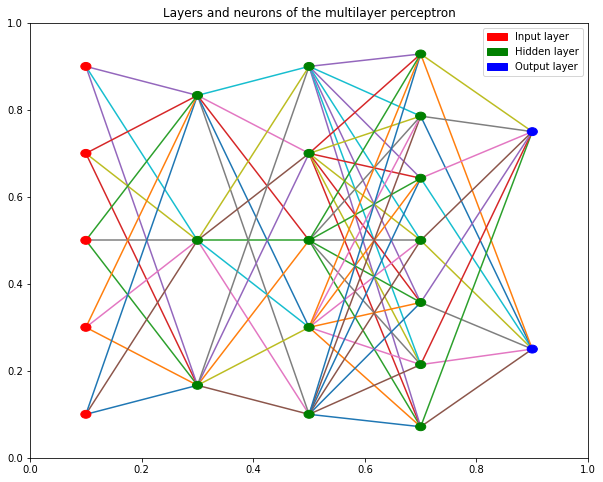
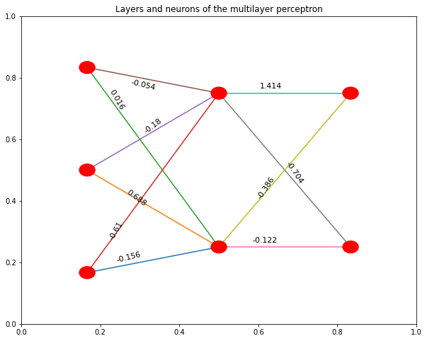

# AbelNN: An easy-to-use deep learning framework with AutoML

I have implemented several neural networks from scratch using only Numpy, to create my own deep learning library with the main objective of making it easy to use for any user, even those who have never had contact with machine learning. 

To that end, I have developed an Auto Machine Learning algorithm that allows neural networks to be tuned automatically, so that it is not necessary to specify hyperparameters in case it is not desired. Of course, and with more experienced users in mind as well, my library can be used in multiple ways as described on this page.

In this file you will find general information about my module. If you need more information, you can read the documentation of the different classes in the [Documentation](Documentation/) folder. There you will also find detailed information on all classes, methods, procedures, and variables. You also have usage examples in the [Examples](Examples/) folder.

The library code, to be able to import it into your project, is found in the [Code](Code/) folder.

You can also read my paper in the [Paper.pdf](Paper.pdf) file.


# Table of Contents


* [How to use my module](#How-to-use-my-module)
    * [For inexperienced users](#For-inexperienced-users)
    * [For experienced users](#For-experienced-users)
    * [For advanced users](#For-advanced-users)
* [Classes available](#Classes-available)
* [Classification and regression](#Classification-and-regression)
    * [Plot training error](#Plot-training-error)
    * [Drawing fullyconnected layers](#Drawing-fullyconnected-layers)
* [Import and export your models](#Import-and-export-your-models)
    * [Export a model](#Export-a-model)
    * [Import a model](#Import-a-model)
* [Library dependencies](#Library-dependencies)


# How to use my module

My library can be used in 3 different ways, and you can choose depending on your knowledge of Deep Learning.

## For inexperienced users

If you have no experience in Deep Learning you can choose to use the AutoML class. You will not have to specify any parameters for any of my neural networks. You only have to indicate your training and test data.

**Example:** *Training a convolutional neural network without specifying any hyperparameters, using the AutoML module to find the best model for the data:*

```python
import AbelNN

# Instance a default model.
c = AbelNN.ConvNet()
    
# Pass the ConvNet to the AutoML. It returns the best model for your data.
clf = AbelNN.AutoML(c).fit(x_train, y_train, x_test, y_test)

# Train the auto tuned model.
clf.fit(x_train, y_train)

# Use the model to predict your test data.
clf.predict(x_test, y_test)
```

In all the cases executed, my AutoML algorithm is capable of obtaining better results than Random Search and Grid Search in less time:


My AutoML is able to find really good models very quickly, as you can see [in this example](Examples/AutoML/MLP_AutoML.ipynb).

<br>

[To see detailed information and more examples, check my AutoML documentation.](Documentation/AutoML_Abel.md)

<br>

## For experienced users

If you are a bit more experienced, you can also specify the value of all neural network hyperparameters using my library. And if you have never tuned a deep learning model but want to get started, do not worry, I have designed my module to be extremely easy to use even by people who have never used deep learning. In either case, if what you want is to modify the networks without complicating yourself by defining complex architectures, you can use my predefined classes. They are so easy to use that with a single line of code you can completely customize your model.

**Example:**
*This example instantiates a convolutional neural network with 2 convolutional layers of 64 filters each, the first with stride equal to 2 and the second equal to 1, and filters of size 5 in all dimensions of the data in the first layer and 3 in the second layer. After the convolutional layers it has 2 fullyconnected hidden layers, one with 30 neurons and the other with 20. The learning rate is 0.1.*

```python
from ConvNetAbel import *

clf = ConvNetAbel(convFilters=[64,64], convStride=[2,1], convFilterSizes=[5,3], hidden=[30,20], learningRate=0.1)

clf.fit(X_train, y_train)

probabs = clf.predict_proba(X_test)
```

The *fit* function trains your model with your training data, and it automatically determines the number of neurons needed for the input layer and the output layer from the data, thus hiding actions that could overwhelm you at first. For this reason, I have also defined, among other procedures, an internal convolution function that adapts perfectly to the input data, automatically calculating the necessary size of the filters and of each of the outputs of the convolutional layers, to abstract you even more if you do not want to get into those concepts yet. This allows you to use my convolutional neural network class with just the 3 lines above (and the import).

The *predict_proba* function returns the estimated probability (whose sum is not equal to 1) of the prediction made for each of the classes in your problem.

<br>

[To see detailed information and more examples, check the documentation of my different networks.](Documentation/)

<br>

## For advanced users

If you are an advanced user of neural networks, you may want to choose to directly use the internal functions that I have implemented from scratch in my neural networks.

**Example of chaining convolutions:** *To a 28x28 image, apply convolutions with 32 random filters of 3x3 size. Convolve the result with 64 filters of size 3x3, and convolve that result with 128 filters of size 3x3. All this using a stride value of 2 and ReLU as activation function:*

```python
from ConvNetAbel import *
import numpy as np

random_image = np.random.uniform(low=0.0, high=1.0, size=(28,28))
print('Image shape:', random_image.shape)

CNN = ConvNetAbel()

filters1 = np.random.uniform(low=0.0, high=1.0, size=(3,3,32))
em = CNN.conv_filters(random_image, filters1, relu=True, stride=2)
print('First convolutional layer output:', em.shape)

filters2 = np.random.uniform(low=0.0, high=1.0, size=(3,3,64))
em = CNN.conv_filters(em, filters2, relu=True, stride=2)
print('Second convolutional layer output:', em.shape)

filters3 = np.random.uniform(low=0.0, high=1.0, size=(3,3,128))
em = CNN.conv_filters(em, filters3, relu=True, stride=2)
print('Third convolutional layer output:', em.shape)
```
*The example above prints the shape of the array as it goes through the convolutional layers to the end:*
```python
Image shape: (28, 28)
First convolutional layer output: (14, 14, 32)
Second convolutional layer output: (7, 7, 64)
Third convolutional layer output: (4, 4, 128)
```

<br>

In the [documentation of the classes](Documentation/) you will find the description of all the functions and procedures with their parameters, their outputs and their functionality described, as well as information about all the class variables.

# Classes available

Now that you have chosen how you want to use my network, you can take a look at the specific documentation for each class if you need it.

The following table allows you to go directly to the implemented code, to examples of use and to the documentation of each class in my library.


| Implementation               |    Class    |    Code    |  Examples  | Documentation |
|------------------------------|-------------|:----------:|:----------:|:-------------:|
| Multilayer perceptron        | MLP_Abel    | [Click here](Code/MLP_Abel.py) | [Click here](Examples/MLP_Abel%20with%20digits%20MNIST%20images.ipynb) | [Click here](Documentation/MLP_Abel.md)   |
| Convolutional neural network | ConvNetAbel | [Click here](Code/ConvNetAbel.py) | [Click here](Examples/ConvNetAbel%20with%20digits%20MNIST%20images.ipynb) | [Click here](Documentation/ConvNetAbel.md)   |
| Auto Machine Learning | AutoML_Abel | [Click here](Code/AutoML_Abel.py) | - [With MLP](Examples/AutoML/MLP_AutoML.ipynb) <br> - [With CNN](Examples/AutoML/CNN_AutoML.ipynb) | [Click here](Documentation/AutoML_Abel.md)   |
| Main class | AbelNN | [Click here](Code/AbelNN.py) | [Click here](Examples/) | *(This page)*   |

<br>

All algorithm classes are independent and you can directly import each file separately. However, you can also import the *[AbelNN.py](Code/AbelNN.py)* file which imports everything.

# Classification and regression

My library has been used for both classification and regression tasks, with different types of datasets, obtaining excellent results. Moreover, when it comes to classifying images, both my predefined MLP and CNN classes also achieve remarkable test metrics, as you can see in the [examples](Examples/) folder.

## Plot training error

If you want to see the error that the network makes during training to analyze its learning, you can use the procedure *plot_mean_error_last_layer*. You must pass the parameter *debugLevel=1* or higher in the constructor of the MLP or CNN classes to be able to use this procedure, since with the debugging level equal to 0 the error data is not stored.

**Example:** *The following example plots the mean error during training in each epoch, for each of the 10 neurons in the output layer. The labels list contains the name of our classes. As it is an example of the MNIST digit images, we put the different digits:*

```python
# Import the MLP class
# (you could also import the entire AbelNN file as in other examples):
from MLP_Abel import *

# Instance a predefined multilayer perceptron
clf = MLP_Abel(hidden=[20, 30], learningRate=0.001, debugLevel=1)

# Train the network
clf.fit(x_train, y_train_multiclass)

# Name your clases:
labels = ['0','1','2','3','4','5','6','7','8','9']

# Plot the mean error during training:
clf.plot_mean_error_last_layer(labels, byClass=True)
```
**Output:**


*If we call the same plot_mean_error_last_layer procedure as in the previous example, but setting the variable byClass to False, it will show the same plot but averaging the error among all neurons in the output layer:*

```python
clf.plot_mean_error_last_layer(labels, byClass=False)
```

**Output:**


## Drawing fullyconnected layers

With the *draw* procedure you can show a matplotlib plot with the MLP layers or the fullyconnected layers of a ConvNet:

```python
import AbelNN
import numpy as np

mlp = AbelNN.MLP(hidden=[3,5,7])

# Random data as an example
x_train = np.random.uniform(low=0.0, high=1.0, size=(100, 5))
y_train = np.random.uniform(low=0.0, high=1.0, size=(100, 2))

mlp.fit(x_train, y_train)

mlp.draw()
```

**Output:**



You can also indicate if you want to show the value of the weights, as well as change the size of the text and the radius of the neurons:

```python
import AbelNN
import numpy as np

mlp = AbelNN.MLP(hidden=[3])

# Random data as an example
x_train = np.random.uniform(low=0.0, high=1.0, size=(100, 3))
y_train = np.random.uniform(low=0.0, high=1.0, size=(100, 2))

mlp.fit(x_train, y_train)

mlp.draw(showWeights=True, textSize=11, customRadius=0.02)
```

**Output:**



In the [examples](Examples/) folder you have several Jupyter Notebooks in which real problems are solved with my library, and complete examples with the different functions and procedures called to train and predict using my neural networks.


# Import and export your models

All the classes in my library that implement predefined neural networks allow you to import and export your models very easily and quickly.

## Export a model

You can export the network and its variables to a disk file so that it persists after execution and can be used again, even without the need to re-train. It performs the export using the Numpy _load_ and _save_ procedures, and generates various _npy_ files with the content of the network variables. The _filename_ parameter is used for all files during that export as the name prefix.

The export can be done by calling the _exportModel_ procedure of a neural network class:

> _exportModel(self, path='', filename='model')_
>
>
>   - **Parameters**:
>        
>        - **path**: _(Type string, default = '')_ Path where the model will be exported.
>
>        - **filename**: _(Type string, default = 'model')_ Prefix of the files to be generated.
>
>   - **Returns**: None

Example of exporting a multilayer perceptron:

```python
import AbelNN

mpath = 'exportedModels/'
mfilename = 'my_MLP_model'

clf = AbelNN.MLP(hidden=[2,3])
clf.exportModel(mpath, mfilename)
```

Example of exporting a convolutional neural network:

```python
import AbelNN

mpath = 'exportedModels/'
mfilename = 'my_ConvNet_Model'

clf = AbelNN.ConvNet(convFilters=[8, 16], hidden=[2,3])
clf.exportModel(mpath, mfilename)
```

## Import a model

You can import a model of an AbelNN neural network class from a disk file, which will keep all the variables of the instance that was exported.

The files that are used for the import are the _npy_ files that you previously exported, or that someone else shared with you, but that were generated using the _exportModel_ procedure.

The import can be done by calling the _importModel_ procedure of a neural network class. The instance that makes that call will have the same value in all variables as the instance that was exported to those files.

> _importModel(self, path='', filename='model')_
>
>
>   - **Parameters**:
>        
>        - **path**: _(Type string, default = '')_ Path where the exported model files are located.
>
>        - **filename**: _(Type string, default = 'model')_ Prefix of the exported files.
>
>   - **Returns**: None

Example of importing a multilayer perceptron:

```python
import AbelNN

mpath = 'exportedModels/'
mfilename = 'my_MLP_model'

clf = AbelNN.MLP() # Instance a default MLP
clf.importModel(mpath, mfilename) # The variables will be loaded from the file.
```

Example of importing a convolutional neural network:

```python
import AbelNN

mpath = 'exportedModels/'
mfilename = 'my_ConvNet_Model'

clf = AbelNN.ConvNet() # Instance a default ConvNet
clf.importModel(mpath, mfilename) # The variables will be loaded from the file.
```

# Library dependencies

* copy
* math
* matplotlib
* numpy
* pylab (of matplotlib)
* random


